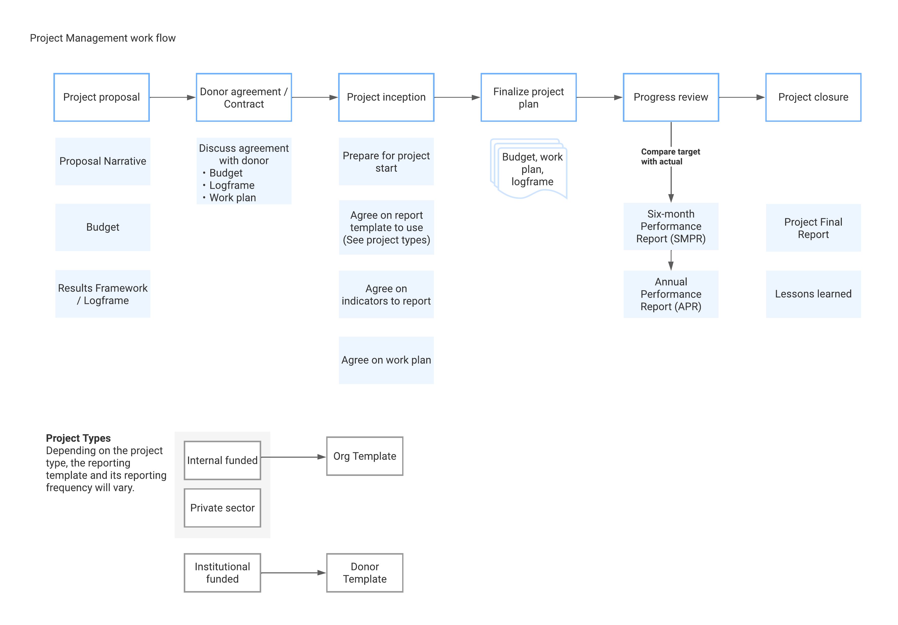

# Metrics Product Requirements Document

| **Target release** | v1.0 |
| :--- | :--- |
| **Title** | Metrics |
| **Last Updated** | 11-Dec-2022 |
| **Document status** | Draft |
| **Document owner** | @andrewtpham |

## **Goals**

**Metrics** is an indicator management tool that allows you to define project KPIs then seamlessly link real-time data sets to allow for easy rollup and reporting.

Metrics is being built from the ground up focusing on bridging the gap between how M&E practitioners currently manage their indicator tracking and help them shift to a more digital tool while integrating with efforts being made on the digital data collection front.

## Unmet needs

This is a list of all current needs identified during the user research and system review stage.

### Configuration

#### General

- **Duplicate user roles**. There are user roles that often duplicate access control and it requires clean up and updated procedures on which to use.
- **Unused configurations**. There are many unused modules that were configured or enabled by default when the system was initially set up and are not being used.

#### Managing users and billing

- **Manual user provisioning.** User management manually managed by the  Admin Configurator and not integrated with any single sign-on tool.
- **Manual checks to de-provision users.** Admin Configurator must perform periodic checks throughout the year to de-provision users who have not logged in/no longer with the organization. This is a procedure that the Country Program should notify the M&E team when a staff member leaves but this does not occur most of the time.
- **User license reporting**. User license fees need to be grouped by Country Program so that they can be paid by the County Program. This requires CP approval and following organization procurement procedures.
- **Internal chargeback procedures**. User license fees are paid as a lump sum to the vendor. This means the M&E team has to perform a check on user licenses by country or project and reconcile costs so that the licenses fees are charged back to the appropriate Country Program
- **Optional user licenses**. It is optional how many user licenses each Country Program should have, which means accessibility to the system can vary country by country.
Duplicate user roles. There are user roles that often duplicate access control and it requires clean up and updated procedures on which to use.

### Data input

#### User experience

- **User interface is complex and not intuitive.** A spreadsheet like look and feel will help users navigate through specific fields while supporting bulk creation and edits can create a familiar interface for viewing data.
- **Limited data validation and creating related data can be unintuitive.** The system will enforce data validation through limiting actions based on data type and create a natural flow on how to create related data in an intuitive way.Additional help text for input fields. Short and concise help text should be added to each field so that users know better what they should enter.
- **Excessive mandatory fields.** Review what fields should be mandatory for all projects to complete so that it better reflects the need of the project maintainer in updating the system.

#### Data quality

- **Data completeness varies across projects.** There are a number of unused fields that are not always filled out. A review is needed to see which fields remain relevant.
- **Data quality varies across projects.** This can make it difficult and require additional cross checking to ensure the data is accurate before using.
- **Manual data quality checks.** Based on demand from Project Approvers and when has time available.

#### Bulk import / export

- **Measurement data is managed inside and outside of the system.** Access to timely and up to date information is needed to inform donor reporting, future proposal development and organizational strategy.

#### Calculations and disaggregations

- **Aggregation reporting setup is complex.** This requires additional attention from Project Maintainers to set up reporting on measurement for the project and for cross project reporting.

### Document upload

#### Creating minimum standards each project should have

- **Mandatory documents uploaded vary across projects.** Documents uploaded by project can vary and there are not easy ways to perform checks on what documents uploaded.
- **Difficult to tell if the right document is uploaded.** It is not always clear what the document status is for uploaded documents.
- **Saving project files varies across projects.** The quality of documents existing or not vary across projects and requires investigation and asking the project teams.

#### Integration with live documents

- **Document collaboration and review process is not well supported.** The system is used to share documents for review but tracked changes are difficult to capture in the system.

### Report generation

- **There is no single source of truth for project data.** All projects are not managed in a single place and in a consistent manner.
- **Project reporting and organizational strategy reporting are considered as two separate reporting channels.** This creates additional work for Project Maintainers to manage both external and internal needs.
- **Project results and narrative summary are not captured in a single place.** Projects and Country Offices use personalized spreadsheet trackers and various word documents to manage their information.
- **Not all donor reporting needs are supported.** The system supports one standard template and creating/updating templates has some technical challenges and limitations.
- **Generating reports often faces technical challenges.** Report templates often have formatting issues that require users to spend a lot of time modifying and cleaning up the document format before it can be shared. This occurs any time measurement data is updated. Report generation can often crash the system and require additional time before it is generated and can be downloaded for viewing.

## Objectives

These are a list of user objectives for `Metrics` to guide its development.

- A simple, intuitive project data management tool. To help our users manage their projects easier so that they can focus on delivering quality services to those who they are serving.
- A tool that can support our multi-prong reporting needs. To help all project’s in standarding its reporting needs and to help our organization in its strategy development and planning.
- A tool that makes it easier to follow a set of procedures. To help users input and extract information for their reporting needs.
- A tool that removes duplication and redundancies and makes it easier to manage. To help automate and reduce manual steps for repetitive tasks or tasks that are prone to human error.

## User personas

There are four (4) main user personas developed for the scope of Project Data Management. This table includes the name, description and example of NGO staff positions that hold each user persona.

| Persona Name | Persona Role Description | Typical Staff Positions |
|---|---|---|
| Decision maker | Data viewer Staff who require project information and reports to inform business decisions Staff who need to search for information on an ad-hoc basis | Country Management, Head Office, Department Heads, Analyst Teams |
| Project approver | Project reviewer Staff who review and provide feedback on project information Staff who perform quality checks to ensure project information is completed Staff who approve project reports before they are submitted externally | Regional Support staff, Project Manager, M&E Manager |
| Project maintainer | Input project information, results frameworks, upload documents Staff who enter information on the project Staff who use standard report templates to report internally and externally | Project Officer, Program Coordinator, M&E Officer |
| Admin configurator | Configure system-wide defaults, manage report templates, user provisioning Staff who review and provide feedback on project information Staff who perform quality checks to ensure project information is completed Staff who approve project reports before they are submitted externally | Regional M&E Advisor, Data Management Team, M&E Support Officer, Digital Support staff |

## User journey map

The user journey map is a diagram used to break down the key steps within a full Project Data Management solution with Metrics only focusing on: 1) Configuration, 2) Data Input, and 3) Report Generation. These are used to group the identified problems or needs of the users. Then each problem or need has a suggested action on how it can be addressed. Finally, user quotes for successes and opportunities are grouped by each step to provide contextual evidence for what works and what doesn’t in the current system.

## **User Requirements**

This is an outline of what is captured for each user requirement. See [**User Requirements**](https://docs.google.com/spreadsheets/d/13tlP9Zo9wamGaXm6TefashYzpz1iEzv2Mxqb2KP0wjY/edit?usp=sharing) spreadsheet for the complete list of user requirements where you can filter by column to view a subset of requirements.

| Feature | As a(n)... | Context | I… | Be able... | So that… | Desirable | Feasible | Viable |
|---|---|---|---|---|---|---|---|---|
| The broader feature this requirement is part of. | State the user persona | Describe the specific context | State the priority | Describe user need | Describe the reason for the need | Is this in demand? | Is this within our capacity to implement? | Does this strategically align? |

## Success metrics

_List project goals and the metrics you'll use to judge its success._

| Step | Goal | Metric |
|---|---|---|
| Configuration | All projects are managed in the system | All active project records can be found in the system |
|  | Users are accessing the system on a frequent basis | Majority of (e.g. 70%) users have logged in in the past 30 days |
|  | Finance Accounting system is integrated into the system | Finance related project fields such as project budget line items and actual spent is displayed in the system |
|  | Portfolio indicators and disaggregations are available to projects | Users can add to their project and use for tracking results |
| Data input | Project fields are relevant and understandable by users | Majority of (e.g. 70%) project fields are completed for active projects |
|  | M&E plans are managed inside of the system | M&E plan spreadsheets are no longer being used |
|  | Project Results Framework are aligned with the Portfolio Results Framework  | At least 1 Portfolio indicator is used for every thematic area the project works in |
|  | Project management features to support data quality are enabled | System history is available for all system users to view |
|  | Kobo Toolbox is integrated into the system | Standard activity monitoring forms are defined for each country |
| Document upload | Document review process is integrated into the system | Documents are stored in single place and only a single version is available for editing and tracked changes |
|  | Document management system is integrated into the system | Uploaded documents are added to SharePoint or SharePoint links are found in the project fields |
| Report generation | There is a single source of truth for all project data | Project indicator and financial information can be seen in a single dashboard or report |
|  | Donor report needs are met | X # of donors have report templates that can be generated from the system |

## Assumptions

_List any assumptions you have about your users, technical constraints, or business goals._

- **Donor report templates**: Donor report templates can either be customized for all major donors or the requirement to use the system to generate the report should be removed.
- **M&E plan**: There is a desire to shift away from M&E plans managed in spreadsheets and the functionality brought into a digital system.
- **Finance accounting integration**: Chart of accounts and project budgeting template are clearly defined and procedures to update are in place
Document management integration: An agreed upon project filing tree is defined and procedures to update are in place.

## User interaction and design

_Add mockups, diagrams, and screenshots related to the requirements._

### High-level features

### Strategy planning

This diagram should the organizational strategy planning process at key events and documents throughout the process.

### Project management

This diagram shows the general project management lifecycle from proposal planning to project closure.

### Budgeting process

This diagram shows the budgeting process that occurs at the Country Program and how it links with individual project budgets.

### Integration with a finance accounting system

This diagram outlines the general process steps for integrating with a finance accounting system and how a “customized integration” with an Enterprise Resource Planning (ERP) system works.

### Integration with a document management system

This diagram shows the process steps for integrating with a document management system and how an overall “out-of–the-box” integration works.

## Out of scope

_List the features discussed which are out of scope or might be revisited in a later release._

- Activity monitoring forms (for now)
- Beneficiary management
- Budget and expenditure management
- Complaint and feedback mechanism
- Qualitative text analysis

## Constraints

_If this issue is affected by or affects another project._

## Explorations + decisions

_Outline what kinds of approaches were considered, and the benefits and drawbacks of each. What decisions the Task Force makes, and why?_

## **Recommendations**

### Current system review

The review of the current system included desk research and interviews with users from Geneva and the Country Programs. The desk research included a complete walk-through of the system to understand how a user interacts with the system. The interviews provided more context on how a user interacts with the system and their pain points they encounter. Based on the the current system review, the following recommendations were identified:

1. **Manage and capture project information in the same way across country programs.** To ensure projects are managed in a standard and consistent manner, it is vital that there is a minimum standard for project information that needs to be captured and inputted for every NGO project. It needs to be explicitly stated that these minimum fields are mandatory. The system owners along with the business owners need to ensure that there is a balance between including too many fields versus too little fields. By making it clear what project information is captured across every country program will help the project maintainers ensure the information is added. 

For any project-specific or country program specific information, these fields need to be grouped together in their own section so it is clear to other users that this information is unique to this project or the team that is managing the project.

2. **Update and communicate what is required minimum input into the system.** Documentation and support material should be frequently updated to reflect changes to what project information needs to be inputted into the system. Since changes can occur throughout the life of the system, it is important when decisions are made to update the mandatory minimum fields, that there is follow up information provided to all system users.

With limited resources to support and maintain a system like the current system, it is important to consider making updates to the support and training procedures as simple as possible without long consultation and review processes. For example support material can be made editable by all the NGO staff so that changes can be submitted and reviewed similar to how wikipedia works.

3. **Review all project fields from time to time to ensure they are relevant and remove any unused fields.** Project fields in the system should be periodically reviewed and scrutinized for its relevance and use. Reports can be generated to show if certain project fields are filled out across the organization as well as analysis on project fields can tell us if the project information is useful or not. When it is identified that some project fields are not completed or no longer useful to the organization, it is important to take action by either removing the field from the system or updating the guidance on how the field is used. Leaving the field in the system can create clutter and confusion with users not being sure if inputting information is needed or not.

This requires frequent attention by the system and business owners to review and debate the usefulness of project fields, especially early when the system has gone live. The system over its life will require constant adjustment to ensure it stays relevant. It is important to have the mindset and expectation for system configurators to make these changes as the system is in use.

4. **Update and communicate what the system can and cannot do.** When a system is implemented and accessible by users, it is important that what the system can and cannot do be clearly communicated to its users. This should be done in both written and verbal communication so that user expectations can be met and that the system is used in the way it was intended.

Systems that have gone live are often faced with user criticism of its functionality or its ease of use. It is important to make clear what the system can help a user with and what it cannot help with. When the system scope is not clearly communicated, user expectations can differ and the system reputation can be damaged.

Ways to help set expectations between users and the system is to be transparent about the system’s active development timeline as well as when a user makes support requests that the requests are addressed and responded to in a timely manner.

5. **Focus attention on what data from the system is being used.** From time to time, it is important that business owners review the data provided from aggregated reports not only for what reporting purposes but examining the underlying metadata. The metadata can help owners understand how the system is being used and if it is being used in the right way. It can identify if there are gaps in data and help raise questions about the system.

By examining the data quality and usefulness of data in the system, business owners can ask whether the system is capturing the right information or not and subsequently isolate unnecessary fields from the system.

### M&E Process Review

6. **Ensure that the strategy planning process is as smooth as possible at the country program and project levels.** During the process review, the strategy planning process was put into a diagram to better understand the process and the frequency intervals. It is important to ensure the country program strategy process is in line with the project planning and implementation to ensure that projects can adequately feed into the country program strategy and subsequently upwards to the organizational strategy.

For example, the M&E process is currently reviewed twice per a year where adjustments and updates can be made. During this review window, it is important to understand what goes into this review process. A more in depth analysis of each Country Program’s process over time can help identify ways to make this process easier.

7. **Explore the automation of M&E reporting so that the system can generate results when all data is inputted.** The M&E reports in the current system have reported discrepancies in them and it is important that these are addressed. In the meantime it is recommended that other cross project reporting can be explored in terms of interactive dashboards that display cross project information so that users can generate and view their Country Program’s results when they need. While the dashboards may be in a different format than the original cross project report in the current system, it is important that the data quality and ability to generate the report when it is needed by users is the top priority.

### Data process review

8. **To avoid confusion, remove any unused modules related to project finances unless it is integrated with the financial accounting system.** There are finance related modules in the current system that track budget and actuals. Since these are not connected to the financial accounting system used by the NGO, it is recommended that these modules be removed from users so as not to cause confusion on what source to use. Any future system should rely on a direct integration between the financial account system to ensure timely data can be imported into the system for viewing purposes alongside the project information.

9. **To support document collaboration, remove the file upload option and replace with add a link option from a central document repository used by the team or project.** With the adoption of document management tools in the NGO such as MS SharePoint and OneDrive, it is recommended that file upload to the current system be removed so that there is not a duplication of files being uploaded. Instead of files being uploaded, a link to SharePoint or where the document is being stored should be provided instead. This can help to address the issues around document collaboration where the current system cannot track changes during a review process by colleagues. By sharing a link to the document, the document owner can specify track changes and manage the latest version for clean up and consolidation. By leaving the file upload procedure in place, this creates additional work for the document authors to have to manage changes.

There is the argument that the current system provides report templates with data from the measurement modules from the current system in the form of charts and tables but if the system faces discrepancies in the data quality or the report format is not up to the standards of the report authors, they will end up re-creating the report in their own document and copy and paste relevant project information.

10. **Develop additional standard report templates that meet donor requirements to be used across country programs as much as possible.** It is recommended that the system and business owners review the donor report templates required by major the NGO donors and attempt to build report templates that more closely align with the donor requirements. The standard the NGO template currently in the system has issues in regard to formatting, discrepancies in data figures that makes them not usable to many users. In the short term, it is recommended that these reports be disabled from the current system and replaced with an interactive dashboard with the same key figures that the reports provided. While the dashboards will not be in the same format as the report template, the information will be accurate.

As the interactive dashboard is enhanced over time, a report that is formatted like a donor report can be explored. But in its current form, these reports are generating data inaccuracies and a report format that is not acceptable on professional standards, these reports will not be used directly. The document authors will opt for copying and pasting the project information they need into a newly formatted report that meets their specifications.