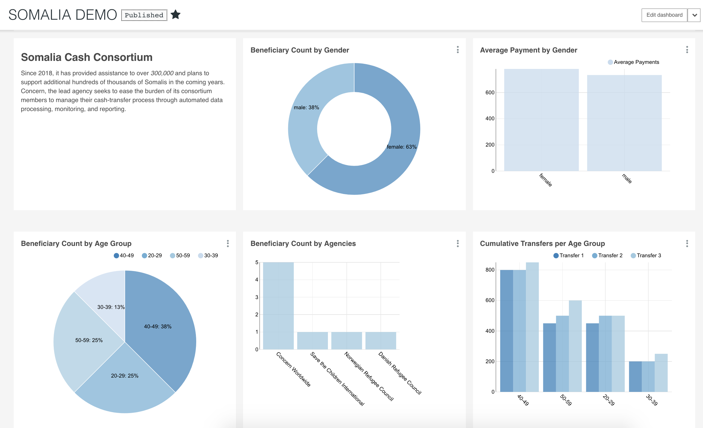

# BI research

## BI Tool Research

## Superset


### Example



Superset is a modern, enterprise-ready business intelligence web application

Its main goal is to make it easy to slice, dice and visualize data. Its developer claims that Superset can perform analytics at the speed of thought, why don’t you check it out yourself?

Superset is open source and does not require any coding. You only need a few technical steps at the beginning, such as cloning the repository and connecting your database to Superset. Once it is done anyone can explore and analyze their datasets. See what Superset can do for you and how to implement it.

Superset is our recommended tool for these reasons:

1. Superset is designed to be highly available. It is “cloud-native” as it has been designed scale out in large, distributed environments, and works well inside containers;
2. Superset is offering way more flexibility than other BI Tool and lets you choose your web server, your metadata database engine, your message queue, your results backend, your caching layer and has the ability to run analytic workloads against most popular database technologies;
3. Superset charts and graphs look appealing, modern and innovative through its wide types of visualizations \(maps, iFrame, Time Series, etc..\);
4. Superset Apache is the most used BI Tool by organizations such as Airbnb, Yahoo! and Twitter.


**Key Features** 

* An intuitive interface to explore and visualize datasets, and create interactive dashboards;
* A wide array of beautiful visualizations to showcase your data \(30 types of visualizations\);
* Easy, code-free, user flows to drill down and slice and dice the data underlying exposed dashboards;
* Deep integration with Druid allows for Superset to stay blazing fast while slicing and dicing large, realtime datasets;
* Accepts all the data sources that support SQL Alchemy;
* Configurable caching options for fast loading dashboards.

**Step 1 :** Download the Repository

* For Windows users:
* Go to your research tab, type cmd and right click on it and choose “Open it as an administrator”.


* Type “cd” + the path to the folder where you want to have Superset. Ex: “cd Desktop”


* Then to clone the repository type: “git clone [https://github.com/apache/incubator-superset”](https://github.com/apache/incubator-superset”) which is Superset’s official github repository.
* For Debian and Ubuntu users:
* Go to the repository where you want to have Superset
* Right click and choose “Open in terminal”
* Then to clone the repository type: “git clone [https://github.com/apache/incubator-superset”](https://github.com/apache/incubator-superset”)


* For Mac users:
* Go to your Launchpad and search for Terminal or in the tabs on the top chose “Utilities” then Terminal.


* Type “cd” + the path to the folder where you want to have Superset. Ex: “cd Desktop”. You can type “pwd” to see where you are located and “ls” to list the folders and filters located in the current working directory.
* Type: “git clone [https://github.com/apache/incubator-superset”](https://github.com/apache/incubator-superset”)
* Instead of the official repository you can clone the repository amancevice/superset to deploy Superset via a Docker container: “git clone [https://github.com/amancevice/superset”](https://github.com/amancevice/superset”). If you do not have experience with Docker containers then you should use the official repository.

**Step 2 :** Launch the server locally

* Install dependencies as explained on the official documentation under the section \(\). Only install the dependencies necessary for your operating system \(Windows, Mac etc.\).
* In that documentation, follow the steps :
* Python virtualenv
* Python’s setup tools and pip,
* Superset installation and initialization
* Configuration: In the research file tab type _superset\_config.py_ and open it to modify the SQLALCHEMY\_DATABASE\_URI which allows the connection between Superset and your Database:

You have to modify the values of the variables POSTGRES\_USER, POSTGRES\_PASSWORD, POSTGRES\_HOST, POSTGRES\_PORT and POSTGRES\_DB according to the values matching to your Database.

Example:


* Run Superset locally: [http://localhost:8088](http://localhost:8088), enter the username and the password of the account you have created.


**Step 3 :** Connect the DataBase to Superset

* Go to the section Sources and click on Databases.


* Click on the “+” button next to Add Filter on the right.
* Choose a Database name and put the correct SQLAlchemy URI and save it.
* You will find the SQLAlchemy URI in the file “superset\_config.py”: SQL\_ALCHEMY\_URI = “ … “ Copy paste it and just replace the last word by the name of the database you want to connect to Superset.
* The SQLAlchemy URI in in the following form: Type of DataBase you use + “://” + your username + your password + “@” the port you use for the database + “/” + the name of the database you want to connect to superset.


* Click on Test Connection to see if the the connection is established. You should receive the message “It seems OK”.

**Step 4 :** Create a table :

* Go to the section Sources and click on Tables.


* Click on the “+” button.
* Choose the correct Database.


* Write the correct table name and save it


**Step 5 :** Create a chart :

* Either go on chart section and click “+” button.
* Or go on Tables section and click on the table you want to make a chart from.
* Choose the datasource \(table\) and the chart Type \(Pie Chart, Table View, Histogram, etc.\).


**Step 6 :** Edit your chart

* Choose the attributs you would like to visualize under the subsection GROUP BY and chose the metrics.


* You can modify other aspects such as Colors in the section Style.
* Save it.

Example :


**Step 7 :** Create a Dashboard

* You can create a Dashboard while saving a chart.


* Or go to the Dashboards section and click the “+” button.
* Choose a name and fill in the necessary rows.
* Select all the charts you want to display on the subsection Charts.


* You can position and resize each charts in the subsection Position JSON:
* slice\_id which can be found by going on the Chart section and clicking on the Chart then at the end of the URL, you can find the id in the form: "slice\_id"%3A**XXX**
* size\_x and size\_y which are for the dimension of the chart you want to display

col and row which are for the position of the chart in the dashboard.

* The position and size of each Chart depend on each other so it has to be positioned correctly otherwise the dashboard would not be as we want.

```text
<u>Example of Position JSON for a dashboard with one chart :</u>

_[_

    _{_

    _ "slice_id":"85",_

    _ "size_x":8,_

    _ "col":9,_

    _ "size_y":8,_

    _ "row":0_

    _}_

_]_


_To change the color of a chart:_

_{_

_    "label_colors": {_
```

\_ \_  _"Girls": "\#FF69B4",_

\_ \_  _"Boys": "\#ADD8E6"_

\_ \_  _}_

* After saving it you can edit it anytime in the Dashboards section.


**Step 7 bis :** Filter your Dashboard \(Optional\)

* You can filter your dashboard using the chart Filter Box in your Dashboard.
* Create a chart of type Filter Box and chose the table to apply the filter


* Select the right Table from the Database and the Attributs you want to filter in the subsection Filter controls and Metric.


* Add the Filter Box in the dashboard.
* You can even configure it in the JSON metadata section when you edit your dashboard if you want your filter to be applied on specifics charts and not all.

```text
Example : 

_{_
```

\_ \_ _"filter\_immune\_slices": \[324, 65, 92\],_

\_ \_ _"expanded\_slices": {},_

\_ \_ _"filter\_immune\_slice\_fields": {_

\_ \_ _"177": \["country\_name", "**from", "**to"\],_

\_ \_ _"32": \["**from", "**to"\]_

\_ \_  _},_

\_ \_ _}_

```text
The slices 324, 65 and 92 are not affected by any filter.

The slices 177 and 32 are not affected by the specified filters.
```

**Step 8 :** Visualize the Dashboard

* Go to the Dashboards section and click on your dashboard.
* You can change the size of charts in the bottom right corner of each chart.


* You can also change directly on the dashboard the position of the charts.
* On the right, click on Edit the Dashboard


* On the right of the chart you can now click the on icon “Move chart”


* After you have finished your edits, you can then save the dashboard on the Drop-down list “Actions” and then click on “Save”.


## Tableau

1. **Dashboard-to-dashboard interactions.** With Tableau, you can copy different dashboard elements and transfer them to other workbooks, which give you plenty of iteration and development possibilities. For instance, you can combine the work of different analysts on a new, seamless dashboard.
2. **SAML authentication.** The newest version of this system can be delegated to SAML authentication, an open source method that makes it possible to create single sign-on on experience. This makes Tableau connectable to any third-party app/system, and usable in all of your departments.
3. **High price**
4. Integration of tableau to database **requires understanding and skills** on database management.

## Datapine

Datapine is a powerful and easy-to-use Business Intelligence tool, designed for non-technical users. Explore your data in our intuitive drag&drop interface, keep track of all your metrics in one place and easily share insights across your organization.

_Datapine can connect to other BI tool such as google analytics but not chargebee and prosperwork._

## Looker

1. **LookML.** Looker is best-known for developing an easier approach to data analytics, namely a brand new database query language call LookML. The language operates like a simplified version of SQL which is reusable and modular, and thus, way easier to learn for first-time users.
2. **Workbook analytics.** Looker adopts your company’s unique business logic. Connect it to any of your relational databases \(BigQuery or Redshift, for instance\), and it will automatically generate a data model based on your schema.
3. **Support for SQL window functions.** Window functions are not-that-well-known SQL functions designed for users to rank customers based on specific behavior without adhering to complex self-joints and first-time variables, or even a series hacks that may require them to transfer data to a third system.
4. **A variety of field parameters.** With Looker, you can define fields with a number of field parameters, including dimensions and dimension groups \(manipulation-prone columns and tables\), measures \(alike aggregate SQL functions that provide row information\), and templated filters \(unique to the user, he can create new ones upon need\).
5. **70% trial-to-win rate.** The possession of a modern exploration language and comparably easy adoption ensured Looker a trial-to-win rate of even 70%, compared to the 11% average measured for the SaaS industry in general.

_Like Superset, no connectors to Google analytics and else._

## Power BI

1. **Non-technical and IT-free performance.** Power BI changes the notion of analytics being reserved for busy IT departments, and makes complex operations accessible to non-technicians. Even without experience, you can connect it to any data source, and summarize the findings in any type of report.
2. **Desktop app built into Excel.** Another unique possibility offered by this system is that you can download a dedicated desktop app to build your Excel summaries and visualizations. Using Power Query, Power Pivot, and Power View extensions, you will also be able to combine large data sets and share them easily on the web.
3. **Drags in all of your enterprise reporting packages.** With a total of 7 years changing experience, Power BI eliminates the need to use external, enterprise-grade applications to prepare reporting suites. The system is connectable to each and every data source, so you can basically use it to report on any matter.
4. **Simple and free sharing.** The traditional way to manage report sharing is to include such in expensive and premium packages, but that’s not the case with Microsoft BI – This system allows users to email reports directly from the platform, and embed them on any web page.
5. **Making use of all data sources.** Power BI doesn’t restrict connectivity – you can process data coming from Salesforce, MailChimp, Google Analytics, QuickBooks, Azure, oData, local libraries, and even Facebook.
6. **The largest number of customizable visualizations.** With Power BI, you can arrange your data in all types of charts including Bubbles, Table Heatmaps, Tornado Charts, Tadpole Spark Grids, Aster Plots, Histograms, Cards, and many more.
7. **Cost-effectiveness.** Many companies choose to launch their BI journey with Power BI, exactly because of the cost-effectiveness of this system. Power BI’s desktop app is free, and so is the web-hosted version for data up to 1 GB. Transition to a paid plan is also made painless, as you can add data for only $10 per month.

## Sisense

1. **Single-Stack architecture:** A single tool that helps you collect, prepare, organize, and analyze data
2. **Optimal use of computational resources:** No need to hire professional analysts, maintain complex hardware, or make excess IT investments

1\) **Joining diverse tables and charts coming from multiple sources:** Sisense’s unique power is that it automatically recognizes and brings together charts and tables from different data sources, and then combines the data contained in them without you preparing it. 1\) **Effective use of CPU cache memory:** Sisense handle terabytes of data rows and thousands of users per day without compromising the quality of performance. You will get results from ad hoc and concurrent queries of rapidly changing data within seconds. 1\) **Diverse data granularity:** Regardless of the complexity of your data models, Sisense will allow you to explore, filter, and drill down inside them, and customize the visual environment independently. 1\) **API-first approach for developers:** Sisense emphasizes scalability, extensibility, and security, which makes it ideal for ISVs, OEMs, and customer-oriented and embedded analyses. Using its suite of RESTful API, you can integrate Sisense in any JavaScript application you’re using. 1\) **A 90-minute real test-drive for prospective clients:** Sisense is the only BI system you can test with actual rather than sample data. Entrust them an actual business case, and they will solve it in 90 minutes.

* No instant connector to Chargebee and Properwork

## Grow:

* 8x Faster Implementation
* 150+ Instant Integrations \( Google Analytics,..\)
* Simple Data Manipulation
* Unlimited Real-Time Updates
* Send Automated Email Reports

Others :

## Metabase

* Open source

## Oracle BI

Cloud Data Platforms:

## Fivetran

## Stitch

## Segment

