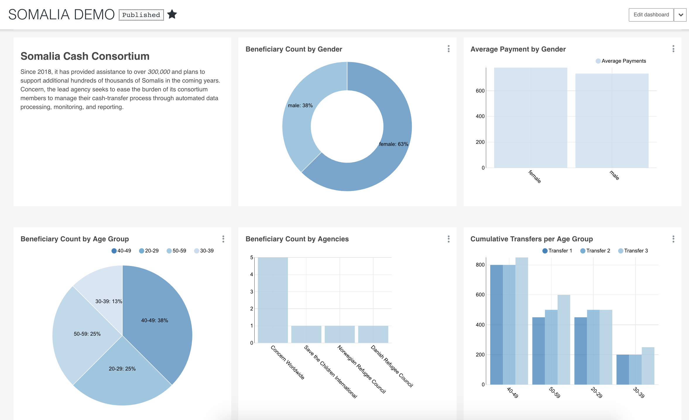

# Superset

## Background

Looking for a tool which would help you visualize, analyse and explore your datasets with amazing Charts and Graphs? Superset Apache is the BI Tool we recommend. This data exploration platform is designed to be visual, intuitive and interactive.

Superset is open source and does not require any coding. You only need a few technical steps at the beginning, such as cloning the repository and connecting your database to Superset. Once it is done anyone can explore and analyze their datasets.

See what Superset can do for you and how to implement it.

## Example

## What is Superset?

Superset is a modern, enterprise-ready business intelligence web application

Its main goal is to make it easy to slice, dice and visualize data. Its developer claims that Superset can perform analytics at the speed of thought, why don’t you check it out yourself?

Superset is our recommended tool for these reasons:

1. Superset is designed to be highly available. It is “cloud-native” as it has been designed scale out in large, distributed environments, and works well inside containers;
2. Superset is offering way more flexibility than other BI Tool and lets you choose your web server, your metadata database engine, your message queue, your results backend, your caching layer and has the ability to run analytic workloads against most popular database technologies;
3. Superset charts and graphs look appealing, modern and innovative through its wide types of visualizations \(maps, iFrame, Time Series, etc..\);
4. Superset Apache is the most used BI Tool by organizations such as Airbnb, Yahoo! and Twitter.

## Key Features

* An intuitive interface to explore and visualize datasets, and create interactive dashboards;
* A wide array of beautiful visualizations to showcase your data \(30 types of visualizations\);
* Easy, code-free, user flows to drill down and slice and dice the data underlying exposed dashboards;
* Deep integration with Druid allows for Superset to stay blazing fast while slicing and dicing large, realtime datasets;
* Accepts all the data sources that support SQL Alchemy;
* Configurable caching options for fast loading dashboards.

## Getting Started

### Step 1 :Download the Repository

**For Windows users:**

* Go to your research tab, type cmd and right click on it and choose “Open it as an administrator”.

* Type “cd” + the path to the folder where you want to have Superset. Ex: “cd Desktop”

* Then to clone the repository type: “git clone [https://github.com/apache/incubator-superset”](https://github.com/apache/incubator-superset”) which is Superset’s official github repository.

**For Debian and Ubuntu users:**

* Go to the repository where you want to have Superset
* Right click and choose “Open in terminal”
* Then to clone the repository type: “git clone [https://github.com/apache/incubator-superset”](https://github.com/apache/incubator-superset”)

**For Mac users:**

* Go to your Launchpad and search for Terminal or in the tabs on the top chose “Utilities” then Terminal.

* Type “cd” + the path to the folder where you want to have Superset. Ex: “cd Desktop”. You can type “pwd” to see where you are located and “ls” to list the folders and filters located in the current working directory.
* Type: “git clone [https://github.com/apache/incubator-superset”](https://github.com/apache/incubator-superset”)
* Instead of the official repository you can clone the repository amancevice/superset to deploy Superset via a Docker container: “git clone [https://github.com/amancevice/superset”](https://github.com/amancevice/superset”). If you do not have experience with Docker containers then you should use the official repository.

### Step 2 :Launch the server locally

* Install dependencies as explained on the official documentation under the section \([https://superset.apache.org/installation.html](https://superset.apache.org/installation.html)\). Only install the dependencies necessary for your operating system \(Windows, Mac etc.\).
* In that documentation, follow the steps :
* Python virtualenv
* Python’s setup tools and pip,
* Superset installation and initialization
* Configuration: In the research file tab typesuperset\_config.pyand open it to modify the SQLALCHEMY\_DATABASE\_URI which allows the connection between Superset and your Database:

You have to modify the values of the variables POSTGRES\_USER, POSTGRES\_PASSWORD, POSTGRES\_HOST, POSTGRES\_PORT and POSTGRES\_DB according to the values matching to your Database.

**Example:**

* Run Superset locally: [http://localhost:8088](http://localhost:8088), enter the username and the password of the account you have created.  

### Step 3 :Connect the DataBase to Superset

* Go to the section Sources and click on Databases.

* Click on the “+” button next to Add Filter on the right.
* Choose a Database name and put the correct SQLAlchemy URI and save it.
* You will find the SQLAlchemy URI in the file “superset\_config.py”: SQL\_ALCHEMY\_URI = “ … “ Copy paste it and just replace the last word by the name of the database you want to connect to Superset.
* The SQLAlchemy URI in in the following form: Type of DataBase you use + “://” + your username + your password + “@” the port you use for the database + “/” + the name of the database you want to connect to superset.

* Click on Test Connection to see if the the connection is established. You should receive the message “It seems OK”.

### Step 4 :Create a table

* Go to the section Sources and click on Tables.

* Click on the “+” button.
* Choose the correct Database.

* Write the correct table name and save it

### Step 5 :Create a chart

* Either go on chart section and click “+” button.
* Or go on Tables section and click on the table you want to make a chart from.
* Choose the datasource \(table\) and the chart Type \(Pie Chart, Table View, Histogram, etc.\).

### Step 6 :Edit your chart

* Choose the attributes you would like to visualize under the subsectionGROUP BY and chose the metrics.

* You can modify other aspects such as Colors in the section Style.
* Save it.

**Example:**

### Step 7 :Create a Dashboard

* You can create a Dashboard while saving a chart.

* Or go to the Dashboards section and click the “+” button.
* Choose a name and fill in the necessary rows.
* Select all the charts you want to display on the subsection Charts.

* You can position and resize each charts in the subsection Position JSON:
* slice\_id which can be found by going on the Chart section and clicking on the Chart then at the end of the URL, you can find the id in the form: "slice\_id"%3AXXX
* size\_x and size\_y which are for the dimension of the chart you want to display col and row which are for the position of the chart in the dashboard.
* The position and size of each Chart depend on each other so it has to be positioned correctly otherwise the dashboard would not be as we want.

**Example of Position JSON for a dashboard with one chart :**

`[{`

`"slice_id":"85",`

`"size_x":8,`

`"col":9,`

`"size_y":8,`

`"row":0`

`}]`

To change the color of a chart:

`{
"label_colors": {
"Girls": "#FF69B4",
"Boys": "#ADD8E6"
}`

* After saving it you can edit it anytime in the Dashboards section.

### Step 7 :Filter your Dashboard

* You can filter your dashboard using the chart Filter Box in your Dashboard.
* Create a chart of type Filter Box and chose the table to apply the filter

* Select the right Table from the Database and the Attributes you want to filter in the subsection Filter controls and Metric.  

* Add the Filter Box in the dashboard.
* You can even configure it in the JSON metadata section when you edit your dashboard if you want your filter to be applied on specifics charts and not all.

Example :

`{
"filter_immune_slices": [324, 65, 92],
"expanded_slices": {},
"filter_immune_slice_fields": {
"177": ["country_name", "__from", "__to"],
"32": ["__from", "__to"]
},
}`

The slices 324, 65 and 92 are not affected by any filter.

The slices 177 and 32 are not affected by the specified filters.

### Step 8 :Visualize the Dashboard

* Go to the Dashboards section and click on your dashboard.
* You can change the size of charts in the bottom right corner of each chart.

* You can also change directly on the dashboard the position of the charts.
* On the right, click on Edit the Dashboard

* On the right of the chart you can now click the on icon “Move chart”

* After you have finished your edits, you can then save the dashboard on the Drop-down list “Actions” and then click on “Save”.

## Security

Superset has the following default roles:

* **Admin**: Admins have all possible rights, including granting or revoking rights from other users and altering other people’s slices and dashboards.
* **Alpha**: The alpha role is for users who need permissions to add or alter tables in any databases. It is suitable for users who want to create new tables, charts, and dashboards
* **Gamma**: The gamma role is for users who need permissions to view and create charts and dashboards. These users will need customized roles that give them read permissions on data sources. Data source access only gives them view permissions on charts and dashboards, without any ability to alter them. But, they can create new charts for permitted data sources.
* **sql\_lab**: The sql\_lab role grants access to SQL Lab. Note that while `Admin` users have access to all databases by default, both `Alpha` and `Gamma` users need to be given access on a per database basis.
* **Public**: This role is used for unregistered users. By default, the public role has no permissions.
