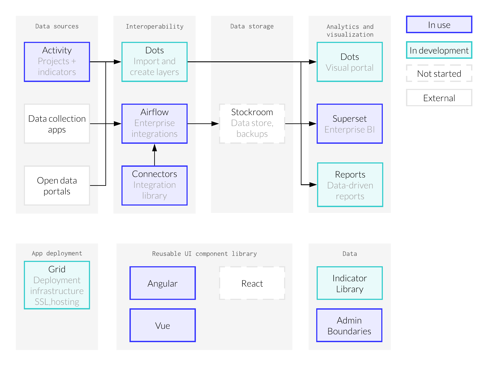

_UPDATED: 20200428_

# Roadmap 
The team has a 6-12 month high-level product roadmaps, which includes goals and feature sets we would like to introduce during this period.

[Activity 2020 Roadmap](/start/activity-roadmap.md) 
[Dots 2020 Roadmap](/start/dots-roadmap.md) 
[Connectors 2020 Roadmap](/start/connectors-roadmap.md) 
[Grid 2020 Roadmap](/start/grid-roadmap.md)

## How our products fit together
Our product goal is to make it easier for data collected from various sources across an organization to be integrated and streamlined for timely analysis and visualization.

Here's is how we see our applications working together to support this.

