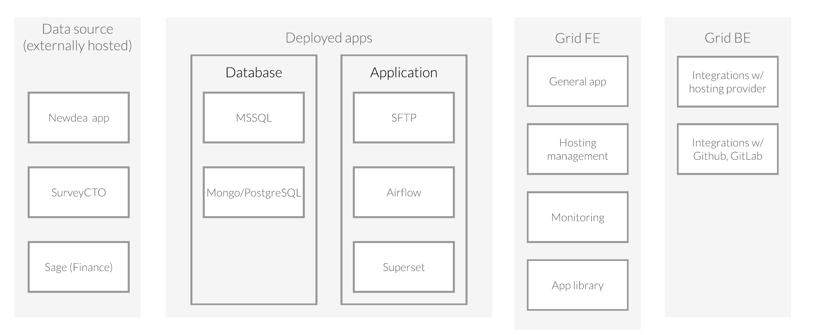

# Grid Product Roadmap 2020 🗺️

Here we present the **Grid** roadmap for the next 6-12 months. This includes high level goals and features we would like to introduce during this period.

**Annotation reference:**

|Icon|Description|
|--|--|
|⚫️|Work not started|
|🏃|Working on|
|✅|Work completed|
|🚀|Stretch goal|
|🌲|High priority|
|🔵|More research required to remove uncertainty|
|🔴|Blocked|

## Goals

Provide a secure environment for organizations to deploy and host their applications on.

- Ensure best practices in IT application security are being followed
- Make hosting easy to manage and cost transparent
- Monitor deployments and run periodic health checks
- A library of pre-configured applications that can be deployed on to your own cloud hosted infrastructure.

## Fundamentals

- Research all the steps needed to deploy a secure environment
- Research which applications to pre-configure for hosting in an organization's environment
- Research how closely can we integrate with various cloud providers (e.g. user account set up, billing, etc.)
  - [DigitalOcean API](https://developers.digitalocean.com/documentation/v2/#introduction)
  - [Azure](https://docs.microsoft.com/en-us/azure/cloud-services/)
  - [AWS](https://docs.aws.amazon.com/)
  - [GCP](https://cloud.google.com/docs)

## General app

- 🏃Ability to register/login to an account
- 🏃Ability to create a workspace
- 🏃Ability to invite new users
- 🌲Ability to sign in your repository account (Github, GitLab)
- 🌲Ability to sign in to your cloud provider account (DO, Azure, AWS, GCP)

## Hosting management

- 🌲Ability to view all resources currently used (broken down by VM/K8 clusters and databases)
- 🌲Ability to view a summary of all costs for resources
- 🔵🚀Ability to add a domain to be managed by your cloud provider

## Monitoring

- 🌲Ability to view alerts / maintenance notifications
- Ability to filter by alert metric
  - CPU
  - Bandwidth
  - Disk
  - Memory Utilization
  - Disk Utilization
- 🚀Ability to view logs from each app
- Ability to set up email notifications based on alert
- Ability to set up slack / MS Team notifications based on alert

## App library

- Ability to search for a pre-configured app
- 🌲Ability to filter by tags
- 🌲Ability to create/view a description page for the app
  - App icon
  - Author
  - Version
  - Description
  - Software included (Repo and license links)
  - Getting started after deploy
  - Support details (documentation links)
- 🌲Ability to create environment using a stepper

## POC (July-August 2020)

- Set up a secure environment
- Deploy 3 client apps on hosted environment
- Add simple monitoring on environment
- User portal with login and simple monitoring dashboard

## Questions

### 1) What is the typical user flow to deploy an app from the App Library?

1. Select the app (from app library)
2. Select the repo where to fork app source code
3. Select the hosting provider
4. Select one of the suggested resource tiers
    - Choose a plan (Basic, General Purpose, CPU-Optimized, Memory-Optimized)
    - Chose resource tier
    - Add block storage
    - Choose a data center
    - Add VPC Network
    - Configure authentication
    - How many VMs and create hostname
    - Add backup
5. Provide an estimated cost and summary
6. Deploy app
7. Add app to monitoring module

### 2) What are all the underlying technologies being used in the deployment of applications?

- Kubernetes
- Helm Charts
- Grafana
- Prometheus
- ElasticSearch
- Elastic LogStash
- ...

### 3) What are the key questions a system administration want answered when monitoring the application's deployment and uptime/downtime?

1. What are the current statuses (uptime/downtime) across all my resources?
2. How much is my estimated bill for resources this month?
3. What resources are not longer being used and could be shut down?
